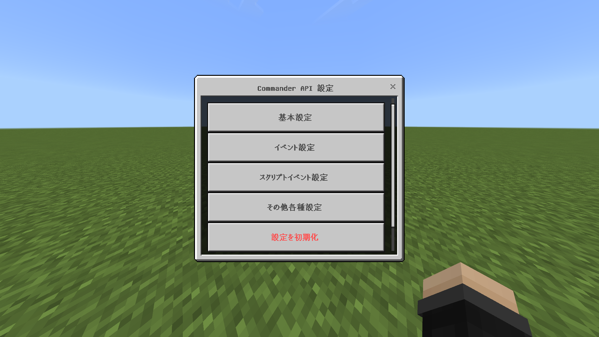
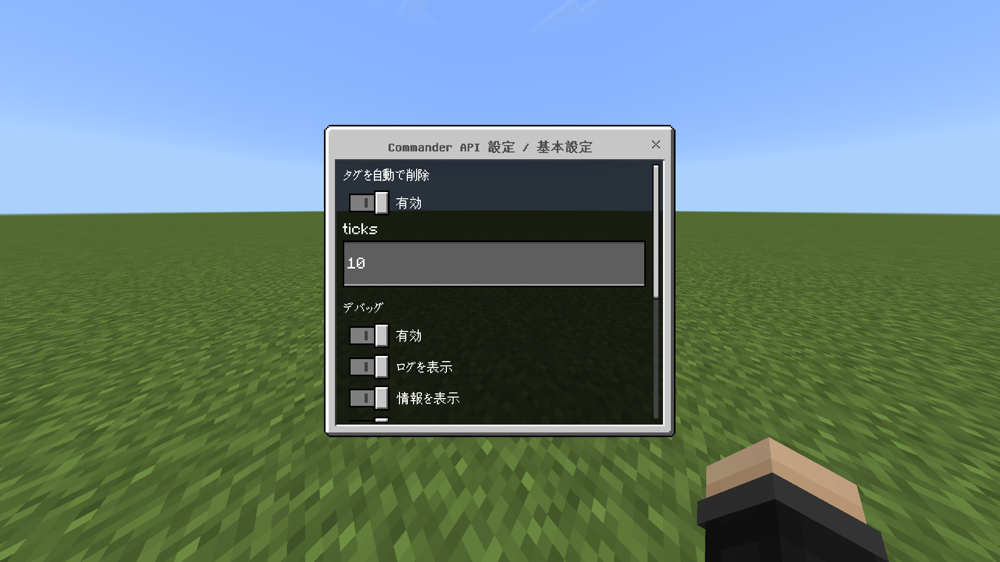
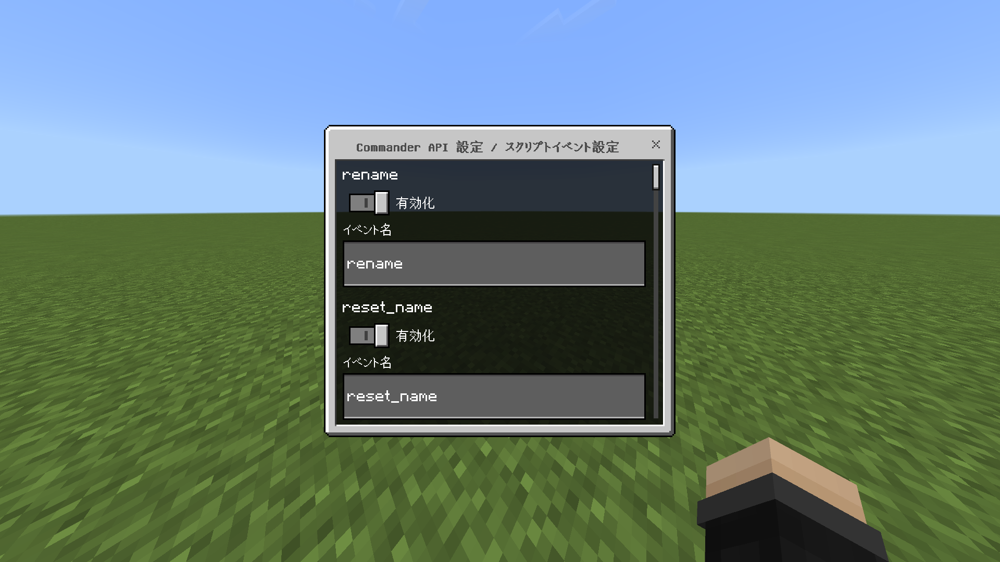
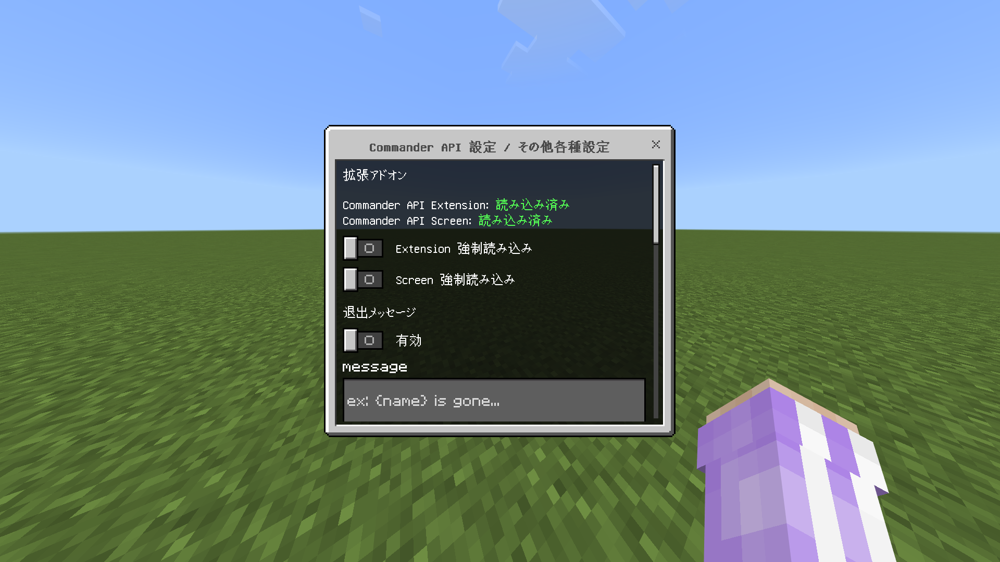
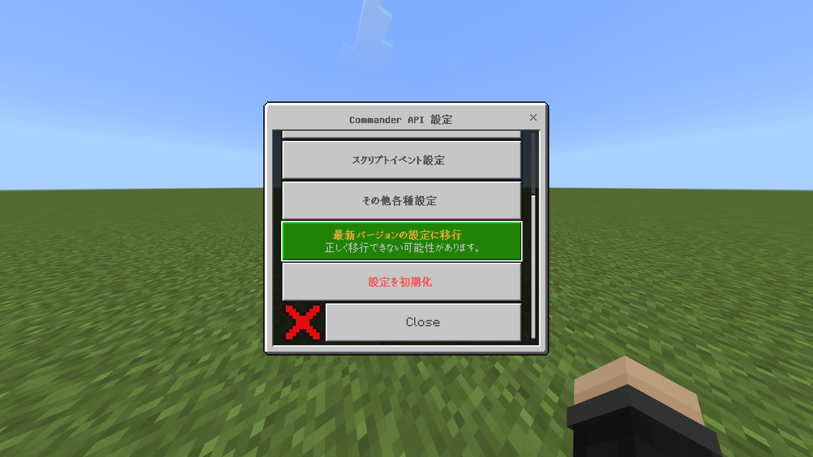
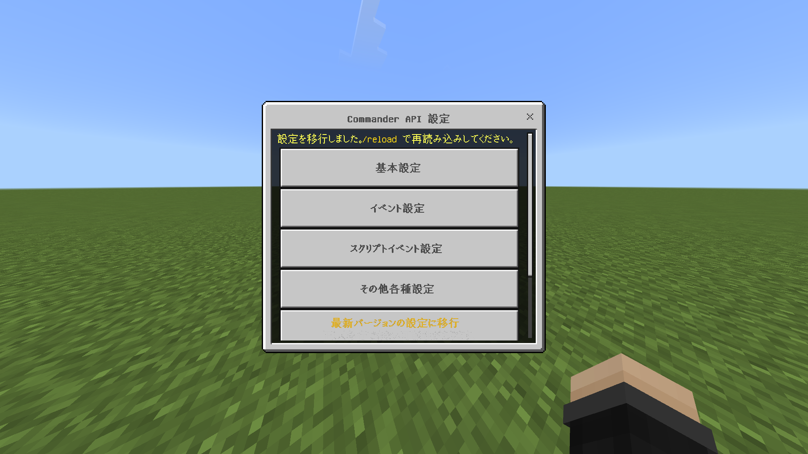
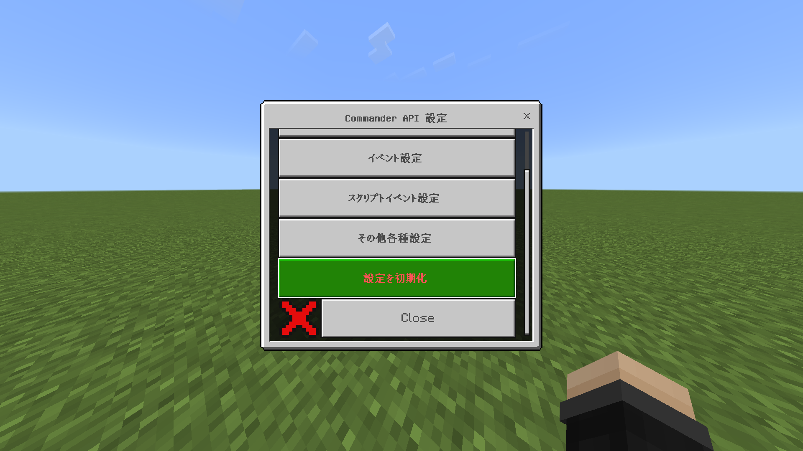
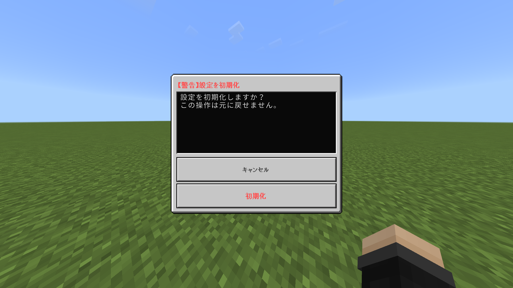
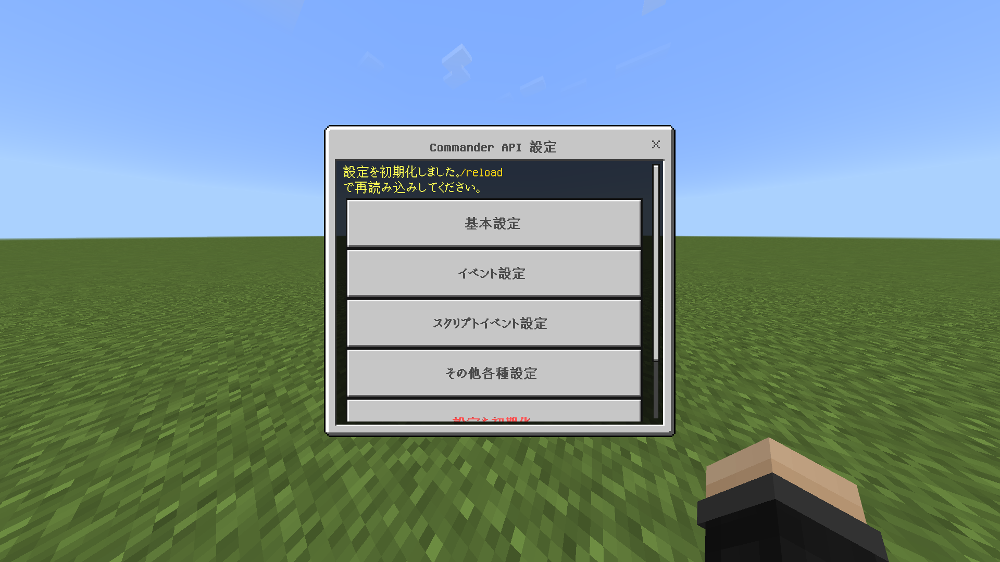

ここでは、Commander API を自分好みにカスタマイズするための設定方法について説明します。

## 設定画面の開き方

以下のコマンドを実行して、Commander API の設定メニューを開いてください。

```mcfunction
/scriptevent capi:config
```

すると、以下のような設定画面が表示されます。



## 各種設定項目

### 基本設定



#### タグを自動で削除

Commander API のイベントなどで追加されたタグを、自動的に削除するかどうかを設定します。<br />
ticksで指定された時間が経過した後にタグが削除されます。

#### デバッグ

Commander API の動作に関する詳細なログをチャットに出力するかどうかを設定します。<br />
これを有効にすることで、すべてのオペレーターがデバッグ情報を受け取ることができます。<br />
コマンドの動作確認や問題のトラブルシューティング、イベントの発火確認などに役立ちます。

#### テスト

Commander API のテストを有効にします。

::: !ref ../ScriptEvent/test

### イベント設定

イベントの無効化やイベント名の変更ができます。


#### buttonPush のイベント名を変更する

`button` を `btn` に変更する例

| 元のタグ名またはスコアボード名 | 変更後のタグ名またはスコアボード名 |
| --- | --- |
| `capi:button` | `capi:btn` |
| `capi:button_x` | `capi:btn_x` |
| `capi:button_y` | `capi:btn_y` |
| `capi:button_z` | `capi:btn_z` |

::: !ref ../Event/buttonPush

#### maxRenderDistance のイベント名を変更する

`max_render_distance` を `mrd` に変更する例

| 元のスコアボード名 | 変更後のスコアボード名 |
| --- | --- |
| `capi:max_render_distance` | `capi:mrd` |

::: !ref ../Event/maxRenderDistance

### スクリプトイベント設定

スクリプトイベントの無効化やスクリプトイベント名の変更ができます。



#### actionbar のスクリプトイベント名を変更する

`actionbar` を `ab` に変更する例

| 元のスクリプトイベント名 | 変更後のスクリプトイベント名 |
| --- | --- |
| `capi:actionbar` | `capi:ab` |

```mcfunction
/scriptevent capi:ab Hello, World!
```

::: !ref ../ScriptEvent/actionbar

### その他各種設定



#### 拡張アドオン

Commander API の公式＆公認拡張アドオンが読み込まれているかを表示します。<br />
`読み込み済み` と表示されているアドオンは Commander API がアドオンを認識しており、拡張アドオンに対応した機能が使用できるようになります。<br />
`未読み込み` と表示されている場合は Commander API がそのアドオンを認識していません。

未読み込みの場合は、拡張アドオンの機能が制限されます。`強制読み込み` を有効にすることで制限を解除できます。

#### 退出メッセージ

プレイヤーがサーバーから退出したときに表示されるメッセージを設定します。  
`{name}` プレースホルダーで退出したプレイヤーの名前を表示できます。

#### チャットのキャンセル

指定された正規表現に基づいて、送信されたメッセージをキャンセルします。<br />
正規表現の書き方は[こちら](https://shining-corn.github.io/ggrks/?q=%E6%AD%A3%E8%A6%8F%E8%A1%A8%E7%8F%BE%20%E3%83%81%E3%83%BC%E3%83%88%E3%82%B7%E3%83%BC%E3%83%88)をご覧ください。<br />
Nanoのおすすめは[こちら](https://developer.mozilla.org/ja/docs/Web/JavaScript/Guide/Regular_expressions/Cheatsheet)です。

#### カスタムチャット

チャットをカスタマイズすることができます。<br />
`{msg}` がメッセージのプレースホルダーです。マクロも使用できます。

WebSocket経由でDiscordなどにメッセージを送信する場合は `WebSocket` を有効にしてください。メッセージがSayで送信されます。

:::warning
WebSocketを使用する場合は名前とメッセージを `::` で区切ってください。
```
<!name>::{msg}
```
:::

#### プライベートチャット

指定したスコアと同じ人たちでチャットできます。スコアが無いまたは 0 の場合は標準のチャットを使用します。


## 設定の保存と反映

設定の変更が完了したら、画面最下部の **設定を更新** または **送信** ボタンをクリックして設定を保存します。
その後、`/reload` コマンドを実行して設定を反映してください。

:::info
`/reload` コマンドを実行するまで、ほかの設定項目は変更できません。
:::

## 最新バージョンの設定に移行

Commander API を新しいバージョンにアップデートした際、設定の形式が変更されている場合があります。その場合、古いバージョンの設定を最新バージョンに移行する必要があります。

:::danger 移行を行わない場合の注意点
設定の移行を行わない場合、アップデートによって追加された新機能を利用できません。必ず、最新バージョンの設定に移行してください。
:::
:::danger 移行に失敗する可能性
何度も最新バージョンへの移行を行わなかったり、Commander API の大幅な変更によって、設定の移行に失敗する可能性があります。その場合、設定を初期化する必要がありますのでご注意ください。
:::



移行後は、`/reload` コマンドを実行して設定を反映してください。



## 設定の初期化

設定の移行に失敗した場合や、設定を最初からやり直したい場合は、設定を初期化することができます。



上のボタンをクリックすると、確認画面が表示されます。



初期化後は、`/reload` コマンドを実行して設定を反映してください。

