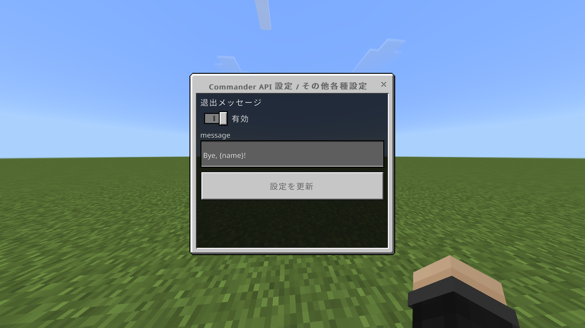

## 説明
プレイヤーがサーバーから退出したときにトリガーされるイベントです。

---

## 特殊機能
- 設定が有効な場合、プレイヤーの退出メッセージが自動的に送信されます。
- 退出メッセージは設定ファイルでカスタマイズ可能です。
- `{name}` プレースホルダーで退出したプレイヤーの名前を表示できます。

## 注意事項
このイベントはプレイヤーがすでにサーバーから退出した後に発生するため、退出したプレイヤー自身に対してコマンドを実行することはできません。プレイヤー名のみが取得可能です。

## 使用例

以下のコマンドで Commander API の設定メニューを開いてください。
```mcfunction
/scriptevent capi:config
```

以下のような画面が表示されます。 **その他各種設定** を選択してください。


次のような設定を行うことで、Notchが退出したときに `Bye, Notch!` というメッセージが表示されます。


設定の保存後、`/reload` コマンドを実行して設定を反映してください。